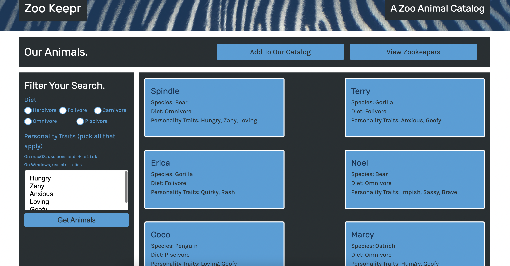

# ZooKeepr
Web server using the Express.js framework and add it to a front-end application that the local zoo is developing, called Zoo Keepr. Then deployed on application to Heroku.

* Configure an Express.js app to serve static files.
* Identify how client-side requests relate to server-side responses.
* Parse optional and required parameters when creating server-side routes.
* Implement client-side POST requests to submit form data to a server.
* Implement separation of concerns for routing.
* Deploy a server-side application to the Heroku platform.

## Deployed link
[Link to Heroku](https://zookeepr121.herokuapp.com/)
(November 2022 heroku is changing policies, may be inactive)

## Screenshot

### Contact or questions
[Coleyrockin Github](https://github.com/coleyrockin)

[Coleyrockin@aol.com](mailto:coleyrockin@aol.com)