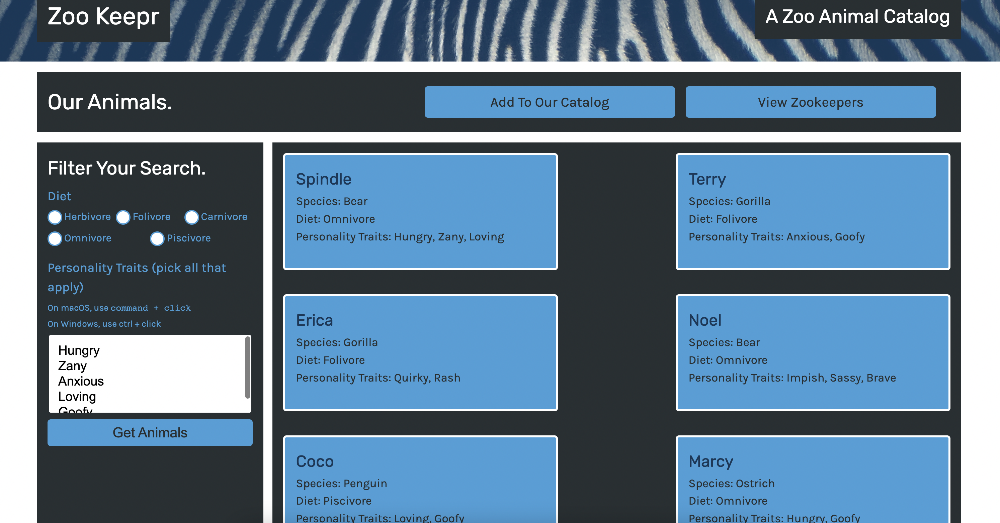

# ZooKeepr
Web server using the Express.js framework and a front-end application that the local zoo is developing, called Zoo Keepr.

* Configure an Express.js app to serve static files.
* Identify how client-side requests relate to server-side responses.
* Parse optional and required parameters when creating server-side routes.
* Implement client-side POST requests to submit form data to a server.
* Implement separation of concerns for routing.

## Free Hosting Options
Since Heroku removed its free tier (November 2022), here are free alternatives for hosting this Node.js/Express app:

| Platform | Free Tier Details | Link |
|----------|------------------|------|
| [Render](https://render.com/) | Free web services (spins down after inactivity) | https://render.com/ |
| [Railway](https://railway.app/) | Free trial with $5 credit/month | https://railway.app/ |
| [Fly.io](https://fly.io/) | Free tier with up to 3 shared VMs | https://fly.io/ |
| [Cyclic](https://www.cyclic.sh/) | Free tier for full-stack apps | https://www.cyclic.sh/ |
| [Glitch](https://glitch.com/) | Free project hosting with editor | https://glitch.com/ |

> **Note:** This app uses `process.env.PORT` which is compatible with all the platforms listed above.

## Screenshot

### Contact or questions
[Coleyrockin Github](https://github.com/coleyrockin)

[Coleyrockin@aol.com](mailto:coleyrockin@aol.com)