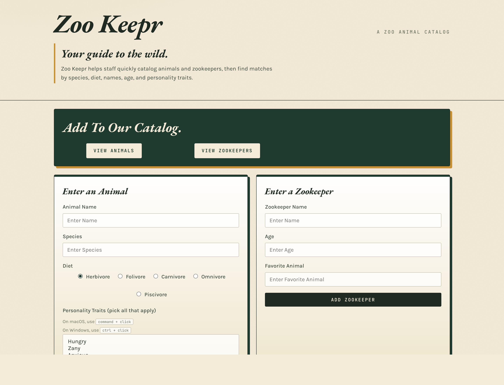
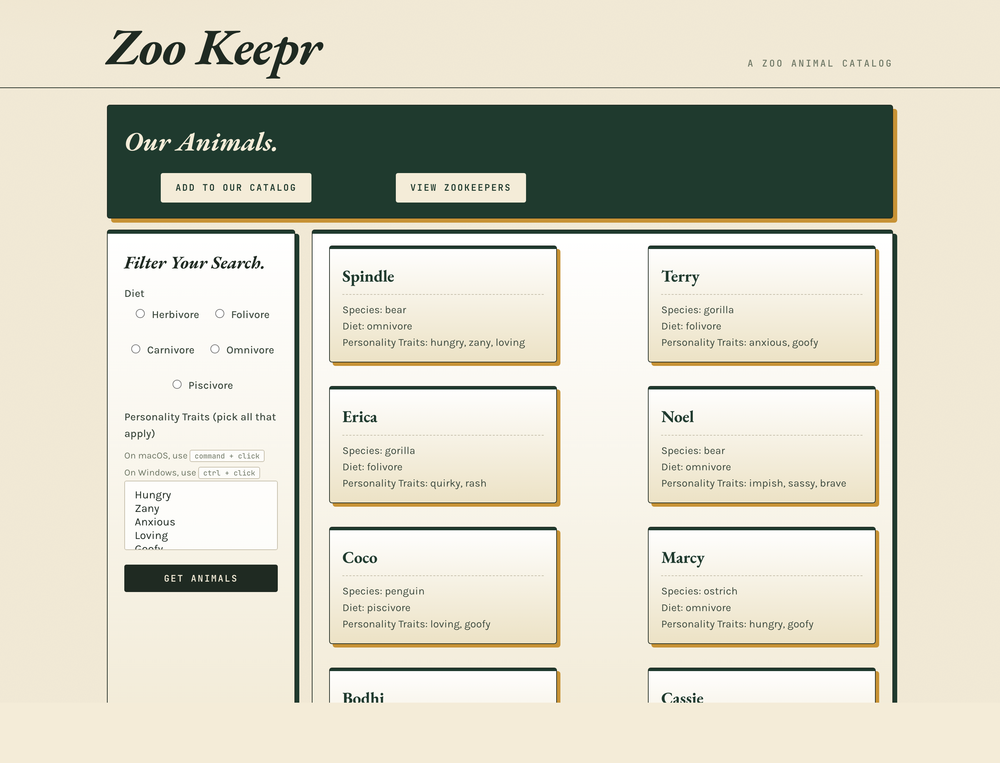
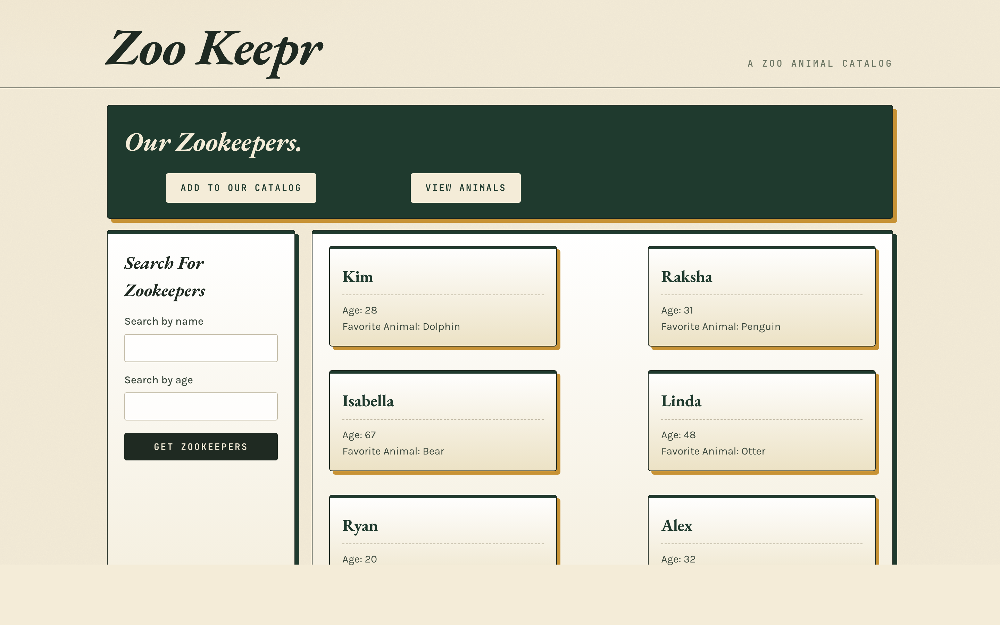

# ZooKeepr


A small full-stack Node.js + Express catalog app for animals and zookeepers. Started as a bootcamp project and lifted to portfolio quality: SQLite-backed via better-sqlite3, paginated and sortable REST API, token-protected write routes, and an editorial "field naturalist's notebook" UI.

## Screenshots

| Home | Animals | Zookeepers |
|------|---------|------------|
|  |  |  |

## Features

- **SQLite-backed storage** via `better-sqlite3` with WAL mode and indexed columns. Auto-seeds from `data/*.json` on first boot if tables are empty.
- **Paginated, sortable list endpoints** (`?limit`, `?offset`, `?sort=field` / `?sort=-field`). Sort field is allowlisted server-side.
- **Token-gated POST routes** with feature-flag, constant-time token compare, and per-IP rate limiting. `X-Forwarded-For` is only trusted when explicitly opted-in via `TRUST_PROXY`.
- **Helmet** for default HTTP header hardening and `express.json` / `urlencoded` body limits set to 16 KB.
- **Self-contained UI** — no Bootstrap, no external CDN runtime; only Google Fonts via `<link>`.
- **Vanilla JS** uses DOM APIs (`textContent`, `replaceChildren`) rather than `innerHTML`, so user-supplied strings cannot inject HTML.
- **24 Jest tests** covering: list filters, pagination, sort, ID lookup, payload validation, write-route auth gating, and rate limiting.

## Tech stack

| Category | Technology |
|----------|------------|
| Runtime | Node.js 22+ |
| Server | Express 4 |
| Database | SQLite via `better-sqlite3` (sync, embedded, WAL) |
| Security | Helmet, custom token + rate-limit middleware |
| Testing | Jest 29 |
| Frontend | Vanilla JS, hand-written CSS (EB Garamond + Karla + JetBrains Mono) |
| Container | Multi-stage Dockerfile (Node 22-alpine, runs as `node` user) |

## Getting started

```bash
git clone https://github.com/coleyrockin/ZooKeepr.git
cd ZooKeepr
npm install
cp .env.example .env
npm start
```

Open http://localhost:3001.

The first request creates `data/zookeepr.sqlite` and seeds it from `data/animals.json` + `data/zookeepers.json`.

### Run tests

```bash
npm test
```

### Run in Docker

```bash
docker build -t zookeepr .
docker run --rm -p 3001:3001 \
  -v $(pwd)/zookeepr-data:/data \
  -e ZOO_WRITES_ENABLED=false \
  zookeepr
```

The SQLite file lives in `/data` so it survives container restarts.

## Environment variables

| Variable | Purpose | Default |
|----------|---------|---------|
| `PORT` | Server port | `3001` |
| `NODE_ENV` | `development` / `production` / etc. | `development` |
| `ZOO_DB_PATH` | Path to the SQLite file. Use `:memory:` for ephemeral. | `data/zookeepr.sqlite` |
| `ZOO_WRITES_ENABLED` | Set `true` to allow POSTs | `false` |
| `ZOO_WRITE_TOKEN` | Required header (`x-zoo-write-token`) when writes are enabled | _unset_ |
| `ZOO_WRITE_RATE_LIMIT` | Max POSTs/min/IP | `30` |
| `TRUST_PROXY` | Pass-through to `app.set('trust proxy', …)`. **Only** set when behind a known reverse proxy. | _unset_ |

A copy of these defaults lives in `.env.example`.

## API

### Read

| Method | Path | Query params |
|--------|------|--------------|
| `GET` | `/health` | — |
| `GET` | `/api/animals` | `name`, `species`, `diet`, `personalityTraits`, `limit`, `offset`, `sort` (`id` / `name` / `species` / `diet`, prefix `-` for DESC) |
| `GET` | `/api/animals/:id` | — |
| `GET` | `/api/zookeepers` | `name`, `age`, `favoriteAnimal`, `limit`, `offset`, `sort` |
| `GET` | `/api/zookeepers/:id` | — |

`limit` is capped at 200; default 50. Unknown sort fields are silently ignored and fall back to `id ASC`.

### Write (token-gated)

| Method | Path | Body |
|--------|------|------|
| `POST` | `/api/animals` | `{ name, species, diet, personalityTraits: [string] }` |
| `POST` | `/api/zookeepers` | `{ name, age (1-130), favoriteAnimal }` |

Required for both:
- `ZOO_WRITES_ENABLED=true` server-side
- `x-zoo-write-token: <ZOO_WRITE_TOKEN>` header (compared with `crypto.timingSafeEqual`)
- Under the per-IP rate limit

## Project structure

```
ZooKeepr/
├── data/
│   ├── animals.json         # Seed data, used on first boot
│   └── zookeepers.json
├── lib/
│   ├── db.js                # better-sqlite3 singleton, schema, seeding
│   ├── animals.js           # animals DAO (list/find/create + pagination)
│   ├── zookeepers.js        # zookeepers DAO
│   └── dataUtils.js         # sanitizeString + leftover write-queue helpers
├── routes/
│   ├── apiRoutes/
│   │   ├── animalRoutes.js
│   │   ├── zookeeperRoutes.js
│   │   ├── writeSecurity.js # rate-limit + token-auth middleware
│   │   └── index.js
│   └── htmlRoutes/index.js
├── public/
│   ├── index.html  animals.html  zookeepers.html
│   └── assets/css/style.css     # field-naturalist aesthetic
│   └── assets/js/{script,animals,zookeepers}.js
├── __tests__/               # 24 Jest tests
├── server.js
├── Dockerfile
└── package.json
```

## Security notes

- All POSTs require `ZOO_WRITES_ENABLED=true` + valid `x-zoo-write-token`. Token compare is constant-time.
- Per-IP rate limit on POSTs (default 30/min). `TRUST_PROXY` is opt-in so headers can't be used to bypass the limit on bare deployments.
- `helmet()` for baseline header hardening; `Content-Type` and `Accept` enforced via Express body parsers with 16 KB limits.
- Inputs are sanitized + length-capped before they hit the DB, and stored via parameterised statements (no string concatenation into SQL).
- Sort fields are allowlisted server-side — query strings cannot inject SQL identifiers into `ORDER BY`.
- DOM rendering uses `textContent` / `replaceChildren` — no `innerHTML` sinks.

## What I learned

- **`better-sqlite3` is the right shape for embedded data** — synchronous API, no callback layering, transactions are first-class.
- **`crypto.timingSafeEqual` is non-negotiable for token compare** — `===` leaks length information through timing.
- **`X-Forwarded-For` should never be trusted by default** — it's an attacker-controlled header unless your hosting environment explicitly sets it.
- **Allowlisting is cheaper than escaping** for things like sort fields. Compare against a `Set` and fall back to a default — you never have to think about SQL escaping for that branch.
- **Auto-seeding from JSON gives a great first-run UX** — clone, `npm start`, and the app already has data.

## Known limitations

- Single-process embedded SQLite — fine for personal/portfolio scale, not for horizontal Node clusters
- No edit/delete endpoints — additions only
- No user accounts; "auth" is a single shared write token
- No image/file upload
- No analytics or audit log

## Future improvements

- `PATCH` / `DELETE` endpoints with the same token gate
- User accounts + per-user write tokens
- Migration files instead of "create-if-not-exists" on boot
- Live deployment (Render / Fly / Railway)

## License

ISC. See [LICENSE](./LICENSE).

## Author

**Boyd Roberts** — [GitHub](https://github.com/coleyrockin)
